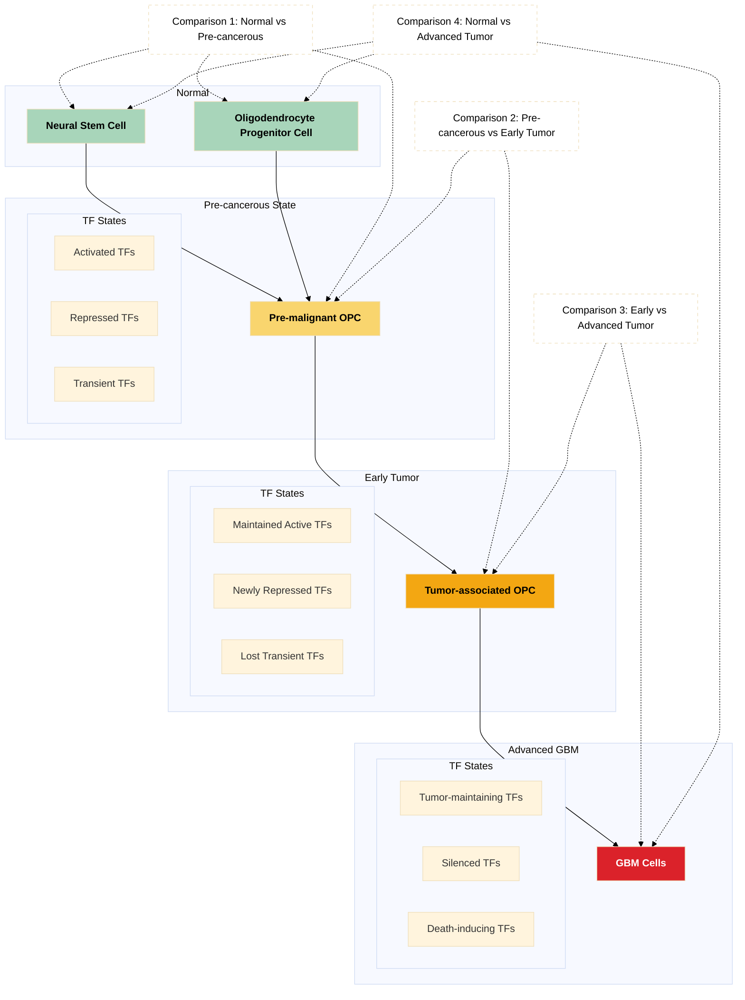

```mermaid
%%{init: {'theme': 'base', 'themeVariables': { 'fontFamily': 'arial', 'fontSize': '16px', 'background': '#ffffff'}}}%%
graph TB
    subgraph Normal
        NSC["<b>Neural Stem Cell</b>"]
        OPC["<b>Oligodendrocyte Progenitor Cell</b>"]
    end

    subgraph "Pre-cancerous State"
        pOPC["<b>Pre-malignant OPC</b>"]
        direction TB
        subgraph TF_States1[TF States]
            A1[Activated TFs]
            R1[Repressed TFs]
            T1[Transient TFs]
        end
    end

    subgraph "Early Tumor"
        tOPC["<b>Tumor-associated OPC</b>"]
        direction TB
        subgraph TF_States2[TF States]
            A2[Maintained Active TFs]
            R2[Newly Repressed TFs]
            T2[Lost Transient TFs]
        end
    end

    subgraph "Advanced GBM"
        GBM["<b>GBM Cells</b>"]
        direction TB
        subgraph TF_States3[TF States]
            A3[Tumor-maintaining TFs]
            R3[Silenced TFs]
            D3[Death-inducing TFs]
        end
    end

    NSC & OPC --> pOPC
    pOPC --> tOPC
    tOPC --> GBM

    %% Key Comparisons
    C1["Comparison 1: Normal vs Pre-cancerous"] -.-> NSC & OPC & pOPC
    C2["Comparison 2: Pre-cancerous vs Early Tumor"] -.-> pOPC & tOPC
    C3["Comparison 3: Early vs Advanced Tumor"] -.-> tOPC & GBM
    C4["Comparison 4: Normal vs Advanced Tumor"] -.-> NSC & OPC & GBM

    classDef normal fill:#a8d5ba,color:#000000
    classDef precancer fill:#f9d56e,color:#000000
    classDef earlytumor fill:#f3a712,color:#000000
    classDef tumor fill:#db222a,color:#ffffff
    classDef comparison fill:#ffffff,stroke-dasharray: 5 5,color:#000000
    
    class NSC,OPC normal
    class pOPC precancer
    class tOPC earlytumor
    class GBM tumor
    class C1,C2,C3,C4 comparison
```